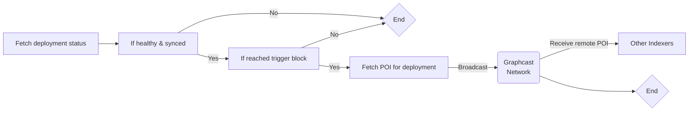
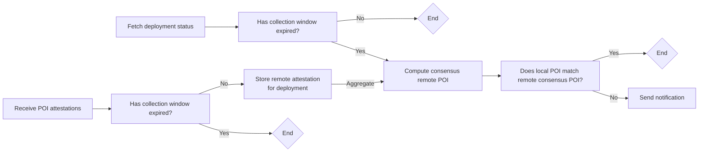
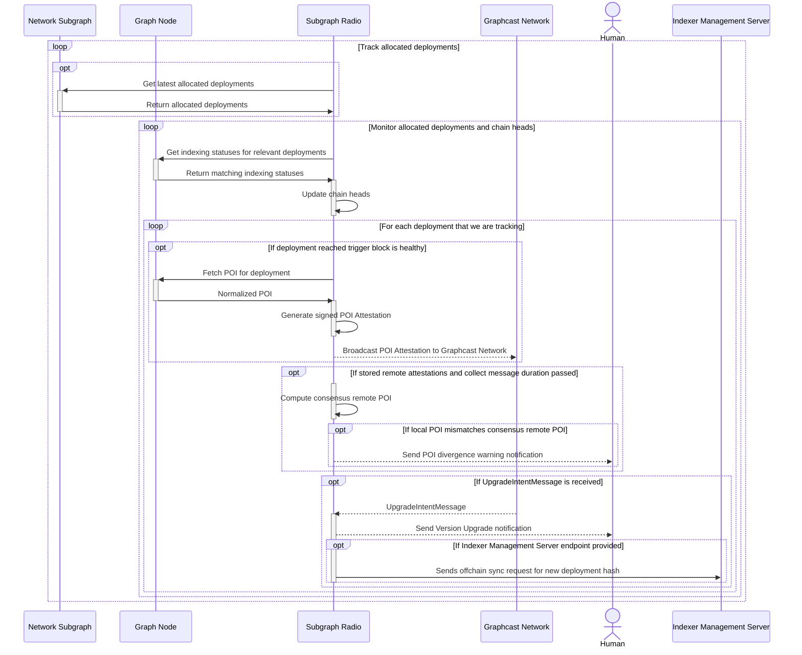

# POI Cross-checking

An essential aspect of earning indexing rewards as an Indexer is the generation of valid Proof of Indexing hashes (POIs). These POIs provide evidence of the Indexer's possession of correct data. Submitting invalid POIs could lead to a [Dispute](https://thegraph.com/docs/en/network/indexing/#what-are-disputes-and-where-can-i-view-them) and possible slashing by the protocol. With Subgraph Radio's POI feature, Indexers gain confidence knowing that their POIs are continually cross-verified against those of other participating Indexers. Should there be a discrepancy in POIs, Subgraph Radio functions as an early warning system, alerting the Indexer within minutes.

All POIs generated through Subgraph Radio are public (normalized), meaning they are hashed with a `0x0` Indexer Address and can be compared between Indexers. However, these public POIs are not valid for on-chain reward submission. Subgraph Radio groups and weighs public POIs according to the aggregate stake in GRT attesting to each. The normalized POI with the most substantial aggregate attesting stake is deemed canonical and used for comparisons with your local Indexer POIs.

## Determining which Subgraphs to gossip about

Subgraph Radio will gossip about different subgraphs depending on the `COVERAGE` configuration (see more). By default, the Radio will gossip about all healthy subgraphs, whether they are allocated to or not.

Subgraph Radio periodically polls the Graph Node for new blocks on all relevant networks and constructs Graphcast topics on each allocation identified by subgraph deployment IPFS hash. Chainheads for these networks are updated with data from the Graph Node, and the Radio ensures that it is always using the latest chainhead when processing messages.

## Gathering and comparing normalised POIs

At a given interval, the Radio fetches the normalised POI for each deployment. This interval is defined in blocks different for each network. It then saves those public POIs, and as other Indexers running the Radio start doing the same, messages start propagating through the network. The Radio saves each message and processes them on a given interval.

The messages include a nonce (UNIX timestamp), block number, signature (used to derive the sender's on-chain Indexer address) and network. Before saving an entry to the map, the Radio operator verifies through the Graph network subgraph for the sender's on-chain identity and amount of tokens staked, which is used during comparisons later on.

At another interval, the Radio compares the local public POIs with the collected remote ones. The remote POIs are sorted so that for each subgraph (on each block), the POI that is backed by the most on-chain stake is selected. This means that the combined stake of all Indexers that attested to it is considered, not just the highest staking Indexer. The top POI is then compared with the local POIs for that subgraph at that block to determine consensus.

If there is a mismatch and if the Radio operator has set up a Slack, Discord and/or Telegram bot integration, the Radio will send alerts to the designated channels.

After a successful comparison, the attestations that have been checked are removed from the store.

## Sequence Diagram

