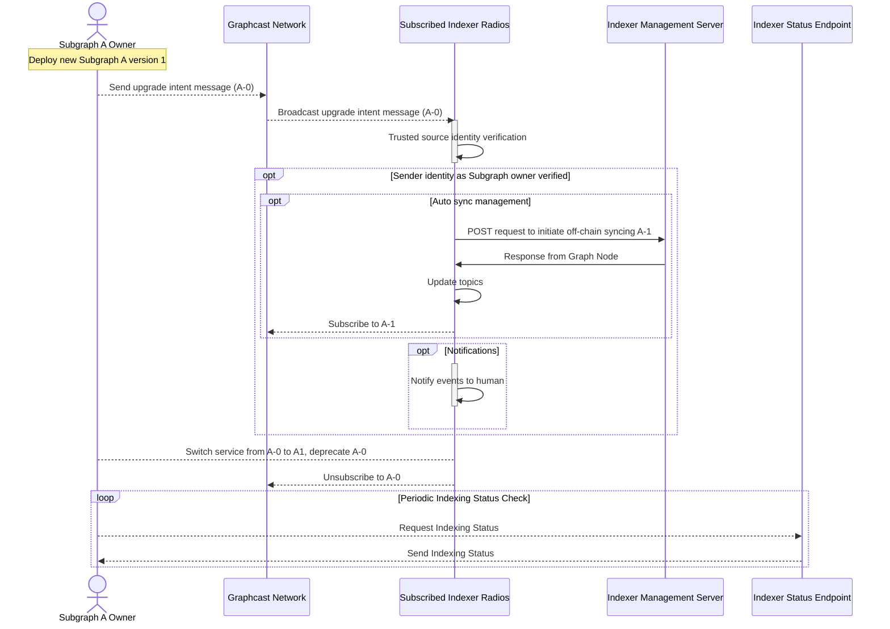

# Subgraph Upgrade Pre-syncing

The Subgraph Upgrade Pre-sync feature provides a way for Subgraph Developers to signal when they plan on releasing a new subgraph version, thereby allowing Indexers to start syncing the subgraph in advance. Subgraph Developers can use the [Graphcast CLI](https://docs.graphops.xyz/graphcast/radios/graphcast-cli) to send a message to all Indexers, interested in the given subgraph.


## As an Indexer running Subgraph Radio

As long as there is a valid configuration for `AUTO_UPGRADE` and `INDEXER_MANAGEMENT_SERVER_ENDPOINT` (see [Advanced Configuration](advanced-configuration)), Subgraph Radio will process Upgrade Intent Messages and automatically begin offchain syncing new Subgraph Deployments.

### Rate Limits

In order to prevent spam, Subgraph Radio implements a rate limit on Upgrade Intent Messages. By default, Subgraph Radio will permit one upgrade for an existing Subgraph Deployment per day.

## As a Subgraph Developer

### Send an Upgrade Intent Message

Refer to the [usage section](https://docs.graphops.xyz/graphcast/radios/graphcast-cli#usage) of Graphcast CLI to learn more about different ways to send a `UpgradeIntentMessage`, as well as the different configurations options available.

Example:

```bash
docker run ghcr.io/graphops/graphcast-cli \
  # pass the address for subgraph deployer
  --graph-account "0xe9a1cabd57700b17945fd81feefba82340d9568f" \
  # pass the pk for the subgraph deployer
  --private-key "0x1234567890abcdef1234567890abcdef1234567890abcdef1234567890abcdef" \
  # specify we want to send an upgrade presync message
  upgrade-presync \
  # specify the subgraph ID
  --subgraph-id "CnJMdCkW3pr619gsJVtUPAWxspALPdCMw6o7obzYBNp3" \
  # specify the new subgraph deployment hash
  --new-hash "QmVVfLWowm1xkqc41vcygKNwFUvpsDSMbHdHghxmDVmH9x"
```

This is what the final log should look like after successfully sending the message:

```bash
INFO graphcast_cli::operator::operation: Sent message, msg_id: "0x126c76b7a5e9a30b3834807e0e02f9858191d153746ae7aebdef90bd4bae9b7a"
    at src/operator/operation.rs:37
```

### Check Indexing Status

After sending an `UpgradeIntentMessage`, a Subgraph Developer can periodically check the indexing status of the new subgraph deployment using the public API of the Indexers who actively allocate on the current version of the subgraph.

Same arguments here can be used as the argument for `UpgradeIntentMessage`. However, _gossiping_ is not involved in this operation and the queries are made through deterministic queries.

Command for querying for the indexing status:

```bash
docker run ghcr.io/graphops/graphcast-cli \
    --private-key "0x1234567890abcdef1234567890abcdef1234567890abcdef1234567890abcdef" \
    --graph-account "0xe9a1cabd57700b17945fd81feefba82340d9568f" \
    indexing-status --new-hash "QmVVfLWowm1xkqc41vcygKNwFUvpsDSMbHdHghxmDVmH9x" \
    --subgraph-id "CnJMdCkW3pr619gsJVtUPAWxspALPdCMw6o7obzYBNp3"
```

## Sequence Diagram

