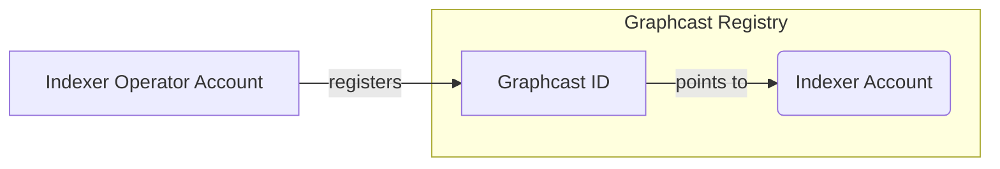

# 🧑‍💻 Radio Development

Do you want to build robust, peer-to-peer messaging apps that automatically exchange valuable data with other Indexers in real time? Do you have an idea for what data could be useful to share that could lead to greater communication efficiency in The Graph network as a whole? Then you want to build a Radio on top of the Graphcast network.

For a more complex and full example of the Graphcast SDK being used to create a POI Radio, take a look at this [implementation in the POC repo](https://github.com/graphops/poi-radio).

## A simple ping pong example

Let's take a look at the simplest possible example of a Radio, built on top of Graphcast - a ping pong app. When one participant sends `Ping`, all the others in the network are listening on the ping pong topic will send `Pong` back. Pretty straightforward.

### Register a Graphcast ID

First things first - before you can run any Radio on Graphcast, you need to register a Graphcast ID for your on-chain Indexer address.

### Registering your Graphcast ID

The Graphcast Registry contract maps Graphcast IDs to Indexers in the Graph Protocol. You'll need to register a Graphcast ID that is authorized to sign messages on behalf of your Indexer in order to use Graphcast.

Here is a brief overview of the accounts you'll be interacting with:

| Account Name             | Description                                                                                                                                |
| ------------------------ | ------------------------------------------------------------------------------------------------------------------------------------------ |
| Indexer Account          | The existing account associated with your Graph Protocol Indexer. This may be a Token Lock Contract address, or a multisig or EOA address. |
| Indexer Operator Account | An account you have registered as an Operator for your Indexer. You can use the Operator account that you pass to `indexer-agent`.         |
| Graphcast ID Account     | A new account that you will create that is used by Graphcast Radio instances to sign messages on behalf of your Indexer.                   |

You'll need to use a registered [Indexer Operator](https://thegraph.com/docs/en/network/indexing/#stake-in-the-protocol) account for your Indexer to register a Graphcast ID.



:::tip
You can register multiple Operators for your Indexer in parallel. If you would prefer not to import the Operator account that you use with `indexer-agent` into your wallet in order to register your Graphcast ID, you can generate and register a dedicated operator account for this purpose. After you have registered your Graphcast ID, you can deregister the dedicated operator if you desire.
:::

1. [Generate a new Ethereum account](https://iancoleman.io/bip39/) to act as your Graphcast ID, keeping the details safe. Be sure to select the Ethereum network, and save the mnemonic, as well as the address and private key for the first account. This is your Graphcast ID.
2. Import your Indexer Operator private key into your wallet (e.g. MetaMask or Frame) in order to send a transaction to register your Graphcast ID.
3. Navigate to Etherscan ([Mainnet registry](https://etherscan.io/address/0x89f97698d6006f25570cd2e31737d3d22aedcbcf#writeProxyContract), [Goerli registry](https://goerli.etherscan.io/address/0x26ebbA649FAa7b56FDB8DE9Ea17aF3504B76BFA0#writeProxyContract)) in order to interact with the Graphcast Registry contract and register your Graphcast ID.
4. Call `setGraphcastIDFor(indexer_address, graphcast_id)`, passing in your Indexer Address and Graphcast ID. Neither address should be your Indexer Operator address that is being used to sign the transaction.
5. Submit your transaction and wait for it to be included in a block.

:::info
Each Graphcast ID can be associated with a single Indexer. To revoke a Graphcast ID for your Indexer, call `setGraphcastIDFor(indexer_address, graphcast_id)` with a Graphcast ID of `0x0` using a registered Indexer Operator Account.
:::

Great, you now have a Graphcast ID that is authorized to sign messages on behalf of your Indexer. You can start building your very first Radio.

### Populate your `.env` file

You now need to export a few environment variables:

| Name                         | Description and examples                                                                                                                                              |
| ---------------------------- | --------------------------------------------------------------------------------------------------------------------------------------------------------------------- |
| `PRIVATE_KEY`                | Private key to the Graphcast ID wallet (Precendence over mnemonics).<br/>Example: `0x0123456789abcdef0123456789abcdef0123456789abcdef0123456789abcdef`                |
| `GRAPH_NODE_STATUS_ENDPOINT` | URL to a Graph Node Indexing Status endpoint.<br/>Example: `http://index-node:8030/graphql`                                                                           |
| `REGISTRY_SUBGRAPH`          | URL to the Graphcast Registry subgraph for your network. You should set the Goerli link - `https://api.thegraph.com/subgraphs/name/hopeyen/graphcast-registry-goerli` |
| `NETWORK_SUBGRAPH`           | URL to the Graph Network subgraph. You can use the testnet one - `https://gateway.testnet.thegraph.com/network`                                                       |
| `GRAPHCAST_NETWORK`          | The Graphcast Messaging fleet and pubsub namespace to use. For this example you should use `testnet`                                                                  |

### A few dependencies

Make sure you have the following installed:

- [Rust](https://www.rust-lang.org/tools/install)
- [Go](https://go.dev/doc/install)
- Build tools (e.g. the `build-essentials` package for Debian-based Linux distributions or [Xcode Command Line Tools](https://mac.install.guide/commandlinetools/index.html) for MacOS)
- C compiler (e.g. the `clang` package for Debian-based Linux distribution or [Xcode Command Line Tools](https://mac.install.guide/commandlinetools/index.html) for MacOS)
- OpenSSL (e.g. the `libssl-dev` package for Debian-based Linux distribution or `openssl` for MacOS)
- PostreSQL libraries and headers (e.g. the `libpq-dev` package for Debian-based Linux distribution or `postgresql` for MacOS)

Start off with a new Rust project (`cargo new ping-pong`). Then add the following dependencies to you `Cargo.toml` file:

```Rust
[dependencies]
graphcast-sdk = "0.1.1"
once_cell = "1.15"
tokio = { version = "1.1.1", features = ["full"] }
anyhow = "1.0.39"
ethers = "1.0.0"
dotenv = "0.15.0"
tracing = "0.1"
ethers-contract = "1.0.0"
ethers-core = "1.0.0"
ethers-derive-eip712 = "1.0.0"
prost = "0.11"
serde = "1.0.147"
serde_derive = "1.0.114"
```

### The imports

Open your `main.rs` file and add the following imports:

```Rust
// Load environment variables from .env file
use dotenv::dotenv;

// Import Graphcast SDK types and functions for agent configuration, message handling, and more
use graphcast_sdk::{
    graphcast_agent::{
        message_typing::GraphcastMessage, waku_handling::WakuHandlingError, GraphcastAgent,
        GraphcastAgentConfig,
    },
    graphql::client_graph_node::{get_indexing_statuses, update_network_chainheads},
    networks::NetworkName,
    BlockPointer,
};

// Import the OnceCell container for lazy initialization of global/static data
use once_cell::sync::OnceCell;

// Import HashMap for key-value storage
use std::collections::HashMap;

// Import Arc and Mutex for thread-safe sharing of data across threads
use std::sync::{Arc, Mutex};

// Import sleep and Duration for handling time intervals and thread delays
use std::{thread::sleep, time::Duration};

// Import AsyncMutex for asynchronous mutual exclusion of shared resources
use tokio::sync::Mutex as AsyncMutex;

// Import tracing macros for logging and diagnostic purposes
use tracing::{debug, error, info};

// Import RadioPayloadMessage from the crate's types module
use types::RadioPayloadMessage;

// Import Config from the crate's config module
use config::Config;

// Include the local config and types modules
mod config;
mod types;
```

### Structure

Everything we need will be inside the `main()` function. And since we'll be using async code we have to annotate it with `#[tokio::main]`, we can start off with something as simple as:

```Rust
#[tokio::main]
async fn main() {
  // TODO: Radio logic
}
```

Before diving into the contents of the `main` function, let's quickly populate the other two files we need - `config.rs` and `types.rs`.

Let's take a look at types.rs first:

```Rust
use async_graphql::SimpleObject;
use ethers_contract::EthAbiType;
use ethers_core::types::transaction::eip712::Eip712;
use ethers_derive_eip712::*;
use prost::Message;
use serde::{Deserialize, Serialize};

#[derive(Eip712, EthAbiType, Clone, Message, Serialize, Deserialize, SimpleObject)]
#[eip712(
    name = "Graphcast Ping-Pong Radio",
    version = "0",
    chain_id = 1,
    verifying_contract = "0xc944e90c64b2c07662a292be6244bdf05cda44a7"
)]
pub struct RadioPayloadMessage {
    #[prost(string, tag = "1")]
    pub identifier: String,
    #[prost(string, tag = "2")]
    pub content: String,
}

impl RadioPayloadMessage {
    pub fn new(identifier: String, content: String) -> Self {
        RadioPayloadMessage {
            identifier,
            content,
        }
    }
}
```

`RadioPayloadMessage` defines the the general structure that the Graphcast SDK expects from a type that will be used as a Radio payload.

`RadioPayloadMessage` is decorated with several macros - #[derive(Eip712, EthAbiType, Clone, Message, Serialize, Deserialize)], which automatically implement certain traits that are required in the SDK.

The `#[eip712]` macro is used to define information that is used in EIP-712, a standard for structuring typed data in Ethereum transactions.

Now let's see the `config.rs` file:

```Rust
use clap::Parser;
use ethers::signers::WalletError;
use graphcast_sdk::build_wallet;
use graphcast_sdk::graphcast_id_address;
use graphcast_sdk::init_tracing;
use serde::{Deserialize, Serialize};
use tracing::info;

#[derive(Clone, Debug, Parser, Serialize, Deserialize)]
#[clap(
    name = "poi-radio",
    about = "Cross-check POIs with other Indexer in real time",
    author = "GraphOps"
)]
pub struct Config {
    #[clap(
        long,
        value_name = "ENDPOINT",
        env = "GRAPH_NODE_STATUS_ENDPOINT",
        help = "API endpoint to the Graph Node Status Endpoint"
    )]
    pub graph_node_endpoint: String,
    #[clap(
        long,
        value_name = "KEY",
        value_parser = Config::parse_key,
        env = "PRIVATE_KEY",
        hide_env_values = true,
        help = "Private key to the Graphcast ID wallet (Precendence over mnemonics)",
    )]
    pub private_key: Option<String>,
    #[clap(
        long,
        value_name = "KEY",
        value_parser = Config::parse_key,
        env = "MNEMONIC",
        hide_env_values = true,
        help = "Mnemonic to the Graphcast ID wallet (first address of the wallet is used; Only one of private key or mnemonic is needed)",
    )]
    pub mnemonic: Option<String>,
    #[clap(
        long,
        value_name = "SUBGRAPH",
        env = "REGISTRY_SUBGRAPH",
        help = "Subgraph endpoint to the Graphcast Registry",
        default_value = "https://api.thegraph.com/subgraphs/name/hopeyen/graphcast-registry-goerli"
    )]
    pub registry_subgraph: String,
    #[clap(
        long,
        value_name = "SUBGRAPH",
        env = "NETWORK_SUBGRAPH",
        help = "Subgraph endpoint to The Graph network subgraph",
        default_value = "https://gateway.testnet.thegraph.com/network"
    )]
    pub network_subgraph: String,
}

impl Config {
    /// Parse config arguments
    pub fn args() -> Self {
        let config = Config::parse();
        init_tracing().expect("Could not set up global default subscriber for logger, check environmental variable `RUST_LOG` or the CLI input `log-level`");
        config
    }

    /// Validate that private key as an Eth wallet
    fn parse_key(value: &str) -> Result<String, WalletError> {
        // The wallet can be stored instead of the original private key
        let wallet = build_wallet(value)?;
        let addr = graphcast_id_address(&wallet);
        info!("Resolved Graphcast id: {}", addr);
        Ok(String::from(value))
    }
}
```

This file defines the `Config` struct and its associated methods for handling configuration options of our Radio. This outlines the basic configuration that all Radios have to define.

The configuration options can be provided through command-line arguments, environment variables, or a combination of both. The `Config` struct parses and validates these options, it also initializes the tracing system for logging purposes.

#### Methods

- `args()`: Parses and returns the configuration options from command-line arguments and environment variables.
- `parse_key(value: &str)`: Validates a given private key by attempting to create an Ethereum wallet with it. Returns the private key as a string if successful.

### Instantiate the essentials

From here on, all following code will be in the `main` function. To start off, we define a name for our Radio, read the provided environment variables and instantiate our configuration struct.

```Rust
// This can be any string
let radio_name: &str = "ping-pong";
// Loads the environment variables from .env
dotenv().ok();

// Instantiates the configuration struct based on provided environment variables or CLI args
let config = Config::args();
```

Now let's instantiate a few variables that will do all the heavy lifting for us.

```Rust
/// A global static (singleton) instance of A GraphcastMessage vector.
/// It is used to save incoming messages after they've been validated, in order
/// defer their processing for later, because async code is required for the processing but
/// it is not allowed in the handler itself.
pub static MESSAGES: OnceCell<Arc<Mutex<Vec<GraphcastMessage<RadioPayloadMessage>>>>> =
    OnceCell::new();

/// The Graphcast Agent instance must be a global static variable (for the time being).
/// This is because the Radio handler requires a static immutable context and
/// the handler itself is being passed into the Graphcast Agent, so it needs to be static as well.
pub static GRAPHCAST_AGENT: OnceCell<GraphcastAgent> = OnceCell::new();

// Subtopics are optionally provided and used as the content topic identifier of the message subject,
// if not provided then they are usually generated based on indexer allocations
let subtopics = vec!["ping-pong-content-topic".to_string()];

// GraphcastAgentConfig defines the configuration that the SDK expects from all Radios, regardless of their specific functionality
let graphcast_agent_config = GraphcastAgentConfig::new(
    config.private_key.expect("No private key provided"),
    radio_name,
    config.registry_subgraph,
    config.network_subgraph,
    config.graph_node_endpoint.clone(),
    None,
    Some("testnet".to_string()),
    Some(subtopics),
    None,
    None,
    None,
    None,
)
.await
.unwrap_or_else(|e| panic!("Could not create GraphcastAgentConfig: {e}"));
```

`GraphcastAgentConfig` takes in an optional vector for content topics. Here we explicitly provide a singleton vector of "ping-pong-content-topic", but you can define topics based on the radio's use case needs. If you leave the field as None, then the agent will automatically fetch your indexer's active allocations and create a list of topics in the format of `radio application name` + the allocated subgraph deployments' IPFS hash.

Next, we will instantiate a `GraphcastAgent`:

```Rust
let graphcast_agent = GraphcastAgent::new(graphcast_agent_config)
    .await
    .expect("Could not create Graphcast agent");
```

`GraphcastAgent` is the main struct through which the Radios communicate with the SDK.

And lastly for the setup part, we need to run two one-off setters for `GraphcastAgent` and for the incoming messages store:

```Rust
// A one-off setter to load the Graphcast Agent into the global static variable
_ = GRAPHCAST_AGENT.set(graphcast_agent);

// A one-off setter to instantiate an empty vec before populating it with incoming messages
_ = MESSAGES.set(Arc::new(Mutex::new(vec![])));
```

Awesome, we're all set to start with the actual Radio logic now!

### Sending messages

We'll define a helper function that holds the logic of sending messages to the Graphcast network:

```Rust
let mut network_chainhead_blocks: HashMap<NetworkName, BlockPointer> = HashMap::new();

// Helper function to reuse message sending code
async fn send_message(
    payload: Option<RadioPayloadMessage>,
    network: NetworkName,
    block_number: u64,
) {
    if let Err(e) = GRAPHCAST_AGENT
        .get()
        .expect("Could not retrieve Graphcast agent")
        .send_message(
            // The identifier can be any string that suits your Radio logic
            // If it doesn't matter for your Radio logic (like in this case), you can just use a UUID or a hardcoded string
            "ping-pong-content-topic".to_string(),
            network,
            block_number,
            payload,
        )
        .await
    {
        error!("Failed to send message: {}", e)
    };
}
```

Again, the `identifier` that we define as `ping-pong-content-topic` can be any string that suits your Radio logic, if it doesn't really matter for your use case (like in the ping-pong Radio case) you can just use a UUID or a hardcoded string.

### Receiving and handling messages

We now know how to send message, but how do we receive and handle message from other network participants?

After `GossipAgent` validates the incoming messages, we provide a custom callback handler that specifies what to do with the message. In this handler we cache the message for later aggregation and processing, but depending on your Radio use case you are free any data storage option - a database, a custom data structure or a simple vector.

Here is a simple handler that does just that:

```Rust
// The handler specifies what to do with incoming messages.
// There cannot be any non-deterministic (this includes async) code inside the handler.
// That is why we're saving the message for later processing, where we will check its content and perform some action based on it.
let radio_handler =
    |msg: Result<GraphcastMessage<RadioPayloadMessage>, WakuHandlingError>| match msg {
        Ok(msg) => {
            MESSAGES
                .get()
                .expect("Could not retrieve messages")
                .lock()
                .expect("Could not get lock on messages")
                .push(msg);
        }
        Err(err) => {
            error!("{err}");
        }
    };

GRAPHCAST_AGENT
    .get()
    .expect("Could not retrieve Graphcast agent")
    .register_handler(Arc::new(AsyncMutex::new(radio_handler)))
    .expect("Could not register handler");
```

### The main loop

Great, we're almost there! We have a way to pass messages back and forth 🏓. But sending a one-off message is no fun, we want to create some sort of scheduled and continuous logic of message exchange, and perhaps the easiest way to do that is to use a block number as cue.

We'll start listening to Ethereum blocks coming from the Graph Node and on each block we'll do a simple check - if the block number is even we'll send a "Ping" message, and if it's odd we'll process the messages we've received. After processing the messages we'll clear our store.

```Rust
let network = NetworkName::from_string("goerli");

loop {
    let indexing_statuses =
        match get_indexing_statuses(config.graph_node_endpoint.clone()).await {
            Ok(res) => res,
            Err(e) => {
                error!("Could not query indexing statuses, pull again later: {e}");
                sleep(Duration::from_secs(5));
                continue;
            }
        };
    update_network_chainheads(indexing_statuses, &mut network_chainhead_blocks);
    let block_number = network_chainhead_blocks
        .entry(network)
        .or_insert(BlockPointer {
            number: 0,
            hash: "temp".to_string(),
        })
        .number;
    info!("🔗 Block number: {}", block_number);

    if block_number & 2 == 0 {
        // If block number is even, send ping message
        let msg = RadioPayloadMessage::new(
            "table".to_string(),
            std::env::args().nth(1).unwrap_or("Ping".to_string()),
        );
        send_message(Some(msg), network, block_number).await;
    } else {
        // If block number is odd, process received messages
        let messages = AsyncMutex::new(
            MESSAGES
                .get()
                .expect("Could not retrieve messages")
                .lock()
                .expect("Could not get lock on messages"),
        );
        for msg in messages.lock().await.iter() {
            let payload = msg
                .payload
                .as_ref()
                .expect("Could not get radio payload payload");
            if *payload.content == *"Ping" {
                let replay_msg =
                    RadioPayloadMessage::new("table".to_string(), "Pong".to_string());
                send_message(Some(replay_msg), network, block_number).await;
            };
        }

        // Clear message store after processing
        messages.lock().await.clear();
    }

    // Wait before next block check
    sleep(Duration::from_secs(5));
}
```

### The finished Radio

Congratulations, you've now written you first full Graphcast Radio! The finished code is also available in [this repo](https://github.com/graphops/graphcast-sdk/tree/main/examples/ping-pong), the only important difference is in the dependencies.

### That's awesome. But how do we run it?

You can start up the ping-pong Radio using `cargo run`.

You can spawn more instances of the `ping-pong` Radio and examine how they interact with each other in the terminal logs.

Now there's just one more thing to do - have fun examining the logs & be proud of yourself - you made it! 🥂 From here on out, the only limit to the Radios you can build is your own imagination.
