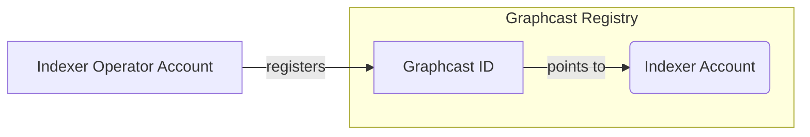

# Registry Contract

The Graphcast Registry contracts allow an address to set a `GraphcastID` by calling `setGraphcastID(indexer_address, graphcastID_address)` as either an Indexer or an Indexer operator, or calling `setGraphcastID(graphcastID_address)` as the Indexer address. The relationship between an Indexer address to its GraphcastID is limited to 1:1, and cannot be set to itself. This restriction provides consistency and security for the Indexer identity to operate on Graphcast as one GraphcastID operating across Radio applications. To learn more about the registry, you can check out [the Github repository](https://github.com/graphops/graphcast-registry).

There are also [subgraphs](https://github.com/graphops/graphcast-registry-subgraph) for these registry contracts. They provide information on both the Indexer registration status and the GraphcastID registration status, specifically mapping the indexer registered on The Graph service registry contract to GraphcastID registered on the Graphcast registry contract.

### Register a Graphcast ID

The Graphcast Registry contract maps Graphcast IDs to Indexers in the Graph Protocol. With a unique Graphcast ID, an Indexer can sign messages for the Radio, eliminating the need to expose their private Indexer (or Indexer Operator) key or mnemonic. This provides an added layer of security, protecting Indexers' sensitive information while enabling participation in the Graphcast Network.

Here is a brief overview of the accounts you'll be interacting with:

| Account Name             | Description                                                                                                                                |
| ------------------------ | ------------------------------------------------------------------------------------------------------------------------------------------ |
| Indexer Account          | The existing account associated with your Graph Protocol Indexer. This may be a Token Lock Contract address, or a multisig or EOA address. |
| Indexer Operator Account | An account you have registered as an Operator for your Indexer. You can use the Operator account that you pass to `indexer-agent`.         |
| Graphcast ID Account     | A new account that you will create that is used by Graphcast Radio instances to sign messages on behalf of your Indexer.                   |

You'll need to use a registered [Indexer Operator](https://thegraph.com/docs/en/network/indexing/#stake-in-the-protocol) account for your Indexer to register a Graphcast ID.

:::tip
You can register multiple Operators for your Indexer in parallel. If you would prefer not to import the Operator account that you use with `indexer-agent` into your wallet in order to register your Graphcast ID, you can generate and register a dedicated operator account for this purpose. After you have registered your Graphcast ID, you can deregister the dedicated operator if you desire.
:::

1. [Generate a new Ethereum account](https://iancoleman.io/bip39/) to act as your Graphcast ID, keeping the details safe. Be sure to select the Ethereum network, and save the mnemonic, as well as the address and private key for the first account. This is your Graphcast ID.
2. Import your Indexer Operator private key into your wallet (e.g. MetaMask or Frame) in order to send a transaction to register your Graphcast ID.
3. Navigate to the Graphcast registry contract [for your preferred network](#registry-contracts) and register your Graphcast ID.
4. Call `setGraphcastIDFor(indexer_address, graphcast_id)`, passing in your Indexer Address and Graphcast ID. Neither address should be your Indexer Operator address that is being used to sign the transaction.
5. Submit your transaction and wait for it to be included in a block.

#### Registry endpoints

| Network          | Registry Contract                                                                                                                               |
| ---------------- | ----------------------------------------------------------------------------------------------------------------------------------------------- | 
| Arbitrum-one     | [0xfae79e8cb8fbac2408e5baf89262bd92b6ca464a](https://arbiscan.io/address/0xfae79e8cb8fbac2408e5baf89262bd92b6ca464a#writeProxyContract)         |
| Arbitrum-sepolia  | [0x17c3a072E5b1B2c260C29D289ee2E7372b8f7C69](https://sepolia.arbiscan.io/address/0x17c3a072E5b1B2c260C29D289ee2E7372b8f7C69#writeProxyContract)  |
| Ethereum-mainnet | [0x89f97698d6006f25570cd2e31737d3d22aedcbcf](https://etherscan.io/address/0x89f97698d6006f25570cd2e31737d3d22aedcbcf#writeProxyContract)        |

:::info
Each Graphcast ID can be associated with a single Indexer. To revoke a Graphcast ID for your Indexer, call `setGraphcastIDFor(indexer_address, graphcast_id)` with a Graphcast ID of `0x0` using a registered Indexer Operator Account.
:::

### Subgraph APIs

Here we list out the APIs the team supports actively. For network subgraph endpoint, We recommend you to expose your indexer-service's endpoint at `/network` queries with authentication. 

Here are the endpoints available on the decentralized network, please replace `[api-key]` with a valid api key for service.

| Protocol Network | Graphcast Network | Registry Subgraph Endpoint                                                       | Network Subgraph Endpoint                                                             |
| ---------------- | ----------------- | -------------------------------------------------------------------------------- | ------------------------------------------------------------------------------------- |
| Arbitrum-One     | `mainnet`         | `https://gateway-arbitrum.network.thegraph.com/api/[api-key]/subgraphs/id/5tHgjCNF4XxAzp9ja8dU3j9JrqU7zctXj6DnxWpwAzc6`     | `https://gateway-arbitrum.network.thegraph.com/api/[api-key]/subgraphs/id/DZz4kDTdmzWLWsV373w2bSmoar3umKKH9y82SUKr5qmp`        |
| Arbitrum-Sepolia  | `testnet`         | `https://gateway-arbitrum.network.thegraph.com/api/{api-key}/subgraphs/id/9bnkkKmSqX3FpoxnBVNFcQfmdSJt2Zc8PrsY1ek64jPr` | `https://gateway-arbitrum.network.thegraph.com/api/[api-key]/subgraphs/id/3xQHhMudr1oh69ut36G2mbzpYmYxwqCeU6wwqyCDCnqV` |
| Ethereum Mainnet | `mainnet`         | `https://gateway-arbitrum.network.thegraph.com/api/[api-key]/subgraphs/id/rcKzonu5NGbKcxCDZoQWmcckRKJw8rnmMNJDV8UeDzJ`     | `https://gateway-arbitrum.network.thegraph.com/api/{api-key}/subgraphs/id/GgwLf9BTFBJi6Z5iYHssMAGEE4w5dR3Jox2dMLrBxnCT`         |
